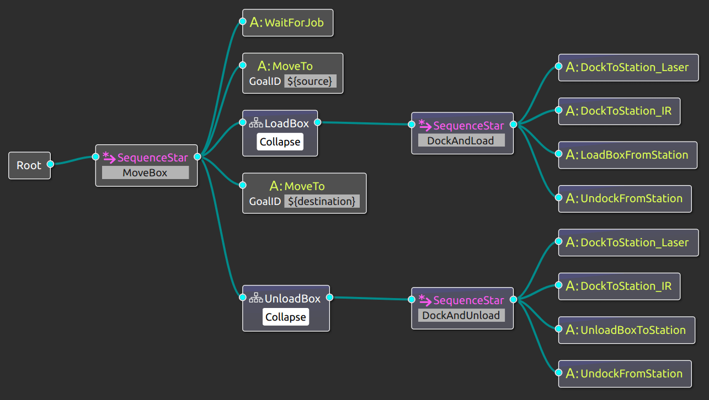

# MOOD2Be

Temporary repository for MOOD2Be-related artifacts

# Compilation instructions (Ubuntu Linux)
`cd MOOD2Be`
`mkdir build`
`cmake ..`
`make`

Executable files are in: MOOD2Be/build/Executor

# Get started with Groot

Download [Groot](https://github.com/BehaviorTree/Groot) version 0.4.2 or later.

You can download and execute Groot easily downloading the latest stable
[AppImage](https://appimage.org/) .

      wget https://github.com/BehaviorTree/Groot/releases/download/0.4.2/Groot-0.4.2-x86_64.AppImage
      chmod +x ./Groot-0.4.2-x86_64.AppImage
      ./Groot-0.4.2-x86_64.AppImage

It should work with Ubuntu 16.04 or later.

# The current tree

